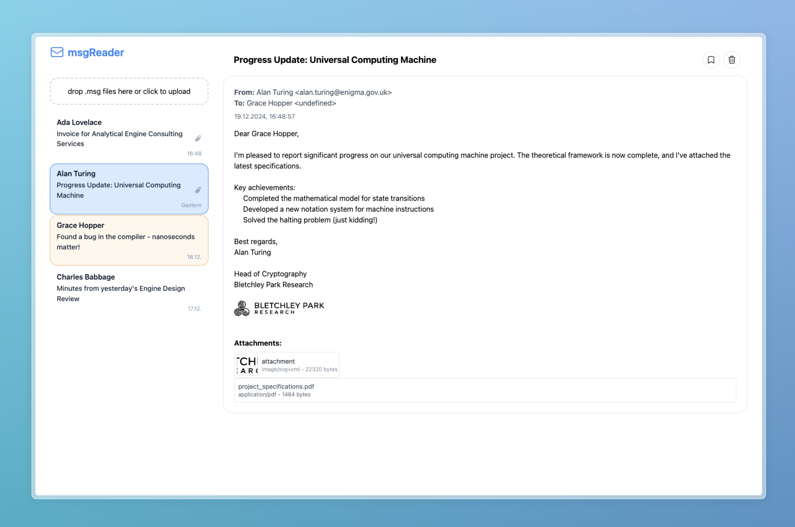

# msgReader



My collegue sends me a lot of emails in the *.msg format. It's the format that "Old Microsoft Outlook" uses if you export an email or attach it to another email.  
I couldn't even open these files on my Windows 11 machine, because of an error that stated that I need an active Microsoft 365 subscription - which is confusing (or **very** wrong), because I have one and it's active in all other MS Office apps.

Since my collegue doesn't stop sending me these <3 and my Feedback to Microsoft a few months ago didn't do anything 💤, I decided to take matters into my own hands.  
I wrote a small tool that can read these files and show them to me (about) how they are shown in email clients - with HTML and inline images and all.

I am currently writing with the Microsoft Support to get this issue fixed, but until then, I have this tool (and everyone who needs to open *.msg files and can't/wont afford a Microsoft 365 Subscription to open a fricking .msg-File).  

... also - WHY would you put a paywall in front of a file format that you created?

## Features
- Open and read *.msg and *.eml files directly in your browser
- View HTML content and inline images
- Pin important messages
- Multiple file support with message list
- Sort messages by date
- Drag & drop support
- No server needed - everything runs in your browser

## Project Structure
The project is organized into several modules:
- `MessageHandler.js` - Manages message state and storage
- `UIManager.js` - Handles UI updates and rendering
- `FileHandler.js` - Manages file operations and drag & drop
- `utils.js` - Contains MSG file processing and utility functions
- `main.js` - Initializes and orchestrates the application

## HYPER Quick Start (GitHub Pages)
1. Open [rasalas.github.io/msg-reader/](https://rasalas.github.io/msg-reader/)
2. Drag your file from your file system and drop it in the drop area.
3. Done.

You should now see your email contents

## Desktop App

A native desktop app is available for **Windows**, **macOS**, and **Linux**. Download the latest release from the [Releases page](https://github.com/Rasalas/msg-reader/releases).

| Platform | Download |
|----------|----------|
| macOS (Apple Silicon) | `.dmg` file ending with `aarch64` |
| macOS (Intel) | `.dmg` file ending with `x64` |
| Windows | `.msi` or `.exe` installer |
| Linux | `.AppImage` or `.deb` package |

### Benefits of the Desktop App
- **Set as default app** for `.msg` and `.eml` files - double-click to open
- **Automatic updates** - the app checks for new versions on startup
- Works offline

### macOS: "App is damaged" or "Can't be opened" Warning

Since the app is not signed with an Apple Developer certificate (which requires a paid subscription), macOS Gatekeeper will block the app. Starting with macOS Sequoia (15), macOS may report the app as "damaged" - **it is not damaged**, this is just how Gatekeeper handles unsigned apps.  

(I have an Apple Developer Account but all that signing is kind of annoying (for iOS) - I might do that later and maybe publish to the App Store too)

**Solution: Terminal**
```bash
xattr -cr /Applications/msgReader.app
```

This removes the quarantine flag that macOS adds to downloaded apps. It only needs to be done once after installation.

### Windows: SmartScreen Warning

Windows may show a "Windows protected your PC" warning. To proceed:

1. Click "More info"
2. Click "Run anyway"

This only needs to be done once after installation.

## Quick Start (locally)
1. Clone the repository
```bash
git clone https://github.com/Rasalas/msg-reader.git
cd msg-reader
```

2. Install the dependencies
```bash
npm install
```

3. Run the application
```bash
npm start
```
A browser window should open with the application running.

## Development
1. Clone the repository
```bash
git clone https://github.com/Rasalas/msg-reader.git
cd msg-reader
```

2. Install the dependencies
```bash
npm install 
```

3. Run the application in development mode
```bash
npm run dev
```

A browser window should open with the application running. The application will automatically reload when changes are made to the source code.

## Build Process
The application uses browserify to bundle the JavaScript modules and tailwindcss for styling.

### Build Commands
- `npm run build` - Builds both JavaScript and CSS
- `npm run build:js` - Bundles JavaScript modules
- `npm run build:css` - Compiles Tailwind CSS
- `npm run watch` - Watches for changes and rebuilds
- `npm run dev` - Runs development server with live reload
- `npm run deploy` - Deploys to GitHub Pages

## Other links

[SourceForge | MsgViewer](https://sourceforge.net/projects/msgviewer/postdownload)  
Java app. Works, basically my favourite, but doesn't show inline images

[encryptomatic.com | Free Online .msg Viewer](https://www.encryptomatic.com/viewer/)  
Kinda sus. I don't really trust them, because they sell the ~same thing as a [product](https://www.encryptomatic.com/msgviewer/msgviewerpro.html). You also can't see inline images and you get an ad in the end of the email instad of in the page itself.

[GitHub | datenteiler/ReadMsgFile](https://github.com/datenteiler/ReadMsgFile)  
Seems to be ok, but it only shows the text version of the email. No inline images or HTML because it uses a command line interface.

[MS Store | MSG Viewer](https://apps.microsoft.com/detail/9nwsk3187kv3?hl=de-DE&gl=DE)  
Costst money and doesn't look promising.

## "Receipts"
account.microsoft.com account page showing an active subsciption. Next payment 26th March 2025 for 69€


a table showing payments of the last three years. Last payment of 69€ on 26th March 2024


Windows 11 Account page showing an active Microsoft 365 Single subscription


An error message stating that the msg file can't be opened, because it requires an active subscription


## Completed Features
- [x] Allow to upload multiple files at once
- [x] Drop area fills the whole screen
- [x] Show a list of all imported emails on the side
- [x] Sort by date
- [x] Show a preview of the currently selected email
- [x] Separate subject, recipients & sender, body, attachments
- [x] Pin important messages
- [x] Add keyboard shortcuts

## Future Improvements (maybe)
- [ ] Allow to download the email as a .eml file
- [ ] Add search functionality
- [ ] Add filters
  - [ ] pinned messages
  - [ ] attachments
  - [ ] sender
  - [ ] subject
- [ ] Add message categories/tags
- [ ] Add dark mode support