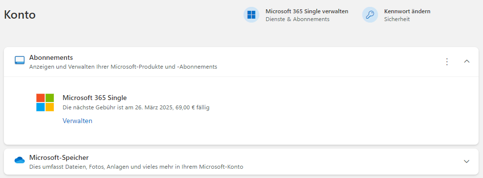
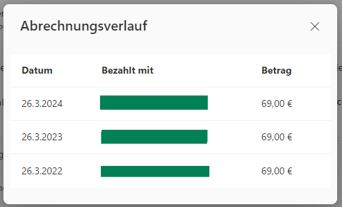
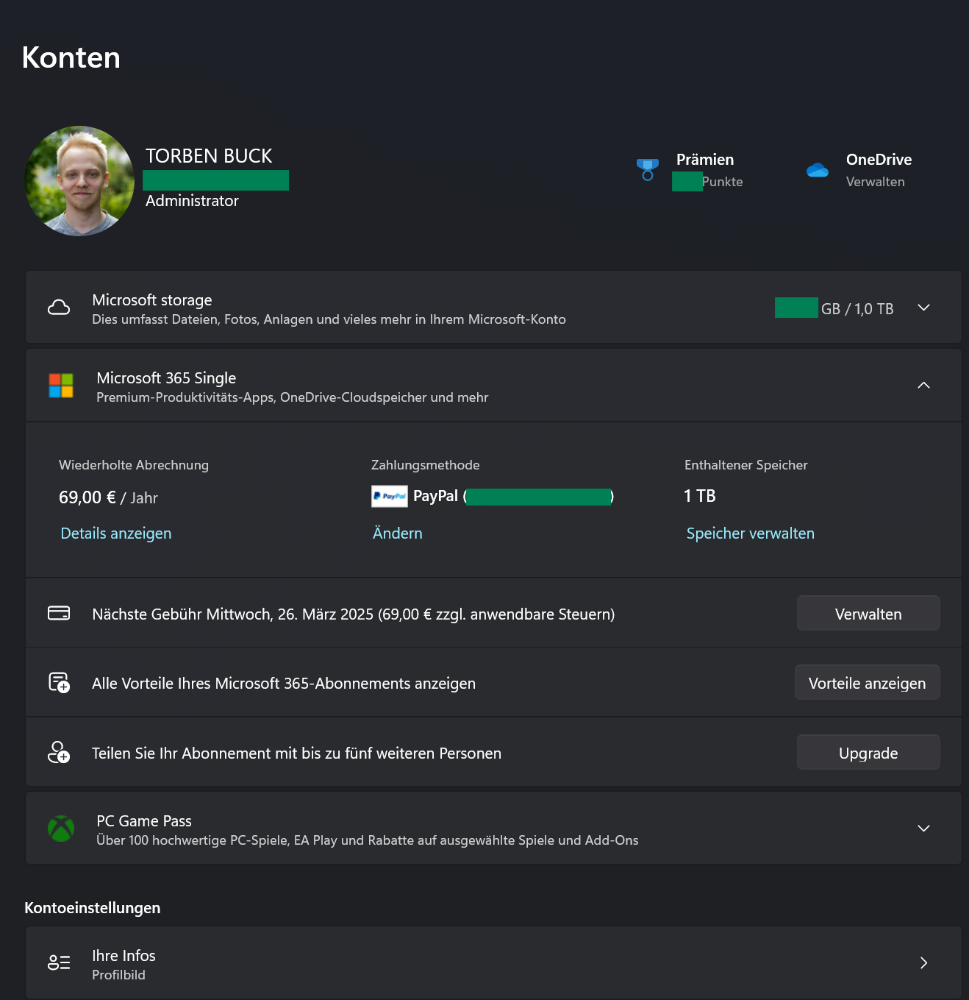
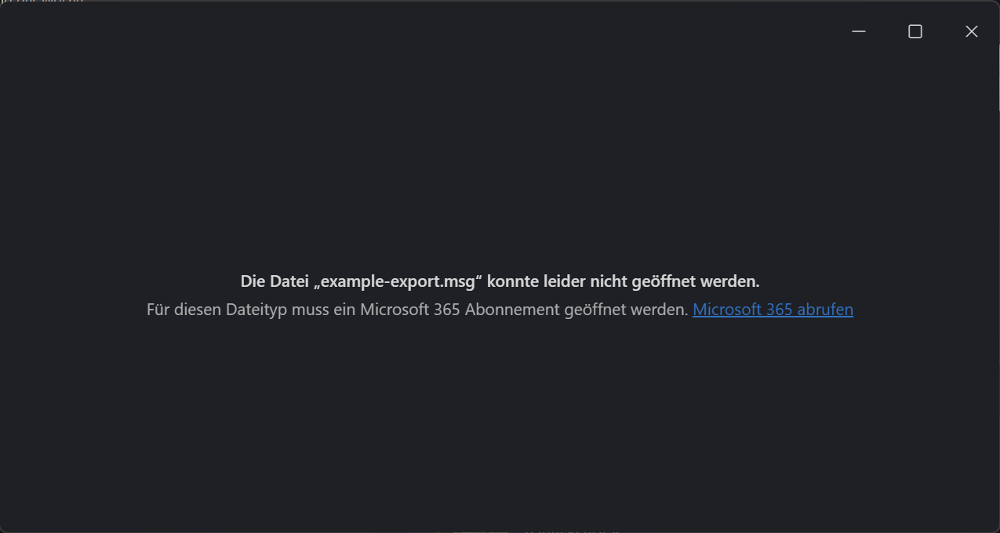

# *.msg Reader

My collegue sends me a lot of emails in the *.msg format. It's the format that "Old Microsoft Outlook" uses if you export an email or attach it to another email.  
I couldn't even open these files on my Windows 11 machine, because of an error that stated that I need an active Microsoft 365 subscription - which is confusing, because I have one and it's active in all other MS Office apps.

Since my collegue doesn't stop and my Feedback a few months ago didn't do anything, I decided to take matters into my own hands.
I wrote a small tool that can read these files and show them to me (about) how they are shown in email clients (with HTML and inline images and all).

I am currently writing with the Microsoft Support to get this issue fixed, but until then, I have this tool.

... also - WHY would you put a paywall in front of a file format that you created? 

## HYPER Quick Start (GitHub Pages)
1. Open [rasalas.github.io/msg-reader/](https://rasalas.github.io/msg-reader/)
2. Drag your file from your file system and drop it in the drop area.
3. Done.  

You should now see your email contents


## Quick Start (locally)
1. Clone the repository
```bash
git clone
```

2. Install the dependencies
```bash
npm install
```

3. Run the application
```bash
npm start
```
A browser window should open with the application running.


## Development
1. Clone the repository
```bash
git clone
```

2. Install the dependencies
```bash
npm install 
```

3. Run the application in development mode
```bash
npm run dev
```

A browser window should open with the application running. The application will automatically reload when changes are made to the source code.

## Other Commands

### Watch
```bash
npm run watch
```
This will watch the code for changes and bundle the code using browserify.

### Build

```bash
npm run build
```
This will bundle the code using browserify and output the bundled code to the `dist` directory inside the `bundle.js`.

### Build it brick by brick

Bundle the code the hard way:
```bash
npx browserify src/msgreader.js -o dist/bundle.js
```

## "Receipts"
account.microsoft.com account page showing an active subsciption. Next payment 26th March 2025 for 69€


a table showing payments of the last three years. Last payment of 69€ on 26th March 2024


Windows 11 Account page showing an active Microsoft 365 Single subscription


An error message stating that the msg file can't be opened, because it requires an active subscription
